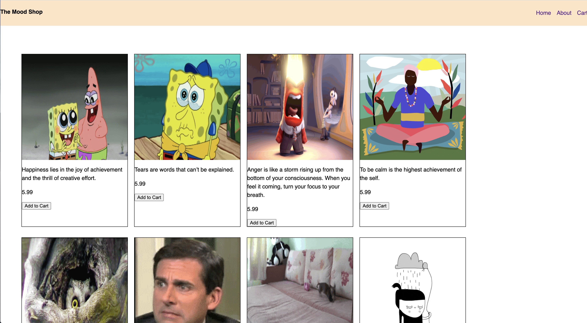
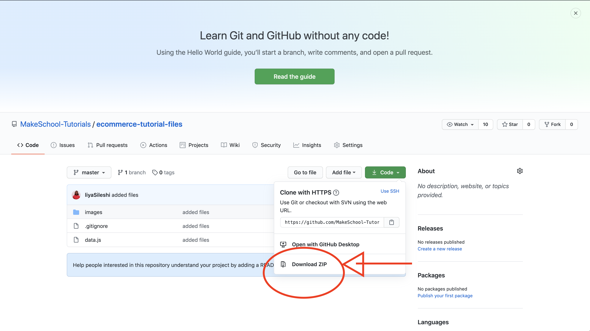
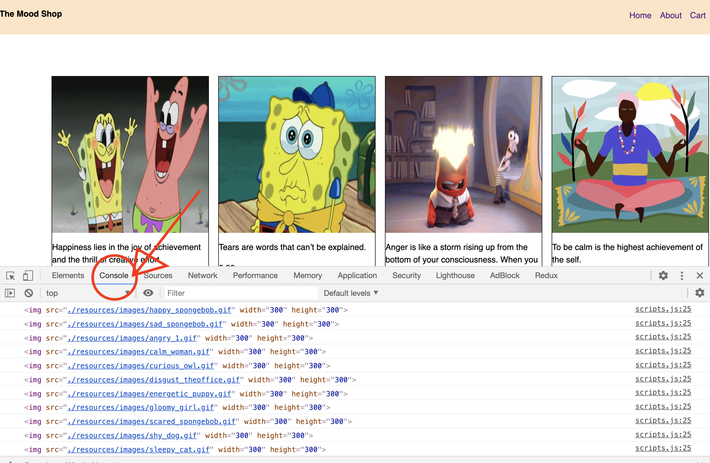
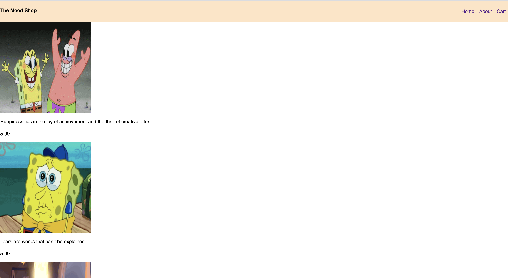
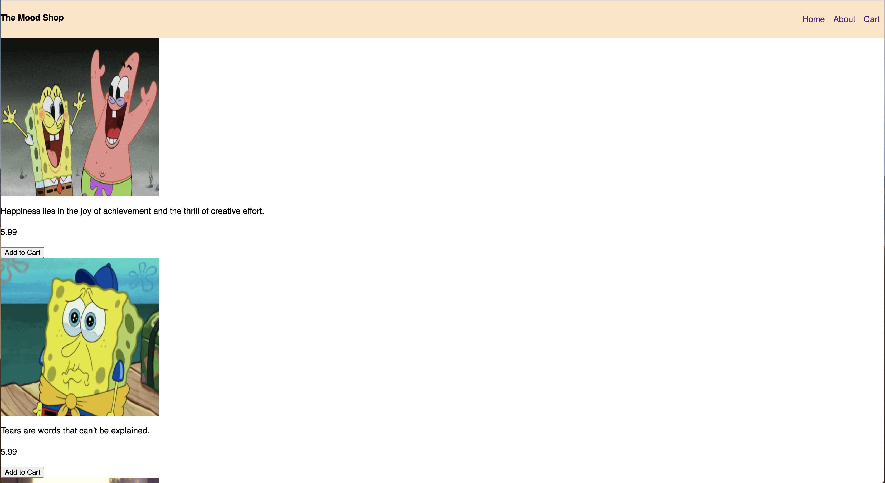

This chapter will focus on displaying all moods on our page. Currently our page has only a navbar.

At the end of this chapter, we will be able to have something like this.



The first thing we need are the images to display for each mood.

The next thing we will need to do is get the json data that holds all the information about each mood including the name, image url, description and price.

The json data that we will be using is located in `data.js` file.

>[action]
>
> Both the images folder and the data.js file are located inside this Github repo : [ecommerce-tutorial-files](https://github.com/MakeSchool-Tutorials/ecommerce-tutorial-files)
>
> Navigate to the github link and download the repo as a zip file.
>


Now navigate to your resources folder.

>[action]
>
> Move the **images** folder that's located in the repo you've just downloaded into the **resources** folder.
>
> Inside your `resources` folder, create another folder named `js`. This folder will hold all your .js files including javascript and JSON files.
>
> Move the `data.js` file located in the repo you've just downloaded to the `js` folder.  

If you open your `data.js` file, you will see an array of JSON data.

```js
const data = [{
  "id": 1,
  "name": "happy",
  "image": "./resources/images/happy_spongebob.gif",
  "desc": "Happiness lies in the joy of achievement and the thrill of creative effort.",
  "price": 5.99
}, {
  "id": 2,
  "name": 'sad',
  "image": './resources/images/sad_spongebob.gif',
  "desc": "Tears are words that can't be explained.",
  "price": 5.99
}
...
```

# What exactly is a JSON data? 🤔

AKA JavaScript Object Notation

A JSON object contains data in the form of key/value pairs:

- The key and value pairs are separated by a colon(:)
- Located left of the colon is the key, and on the right is it's value.

> [info]
>
> Here are a few links to learn more about json objects.
>
> - [Intro to JSON](https://www.copterlabs.com/json-what-it-is-how-it-works-how-to-use-it/) - the first few chapters gives a good introduction to JSON
> - [JSON example](https://www.javatpoint.com/json-example),
> - [JSON short Tutorial](https://restfulapi.net/introduction-to-json/)

Now that we have a good understanding of JSON, we can better understand what the file we are looking at is. The ```data.js``` file contains an array of objects. Each object contains the data for each mood to be displayed. This data consists of **id, name, image, price** and **description** as a **key:value** pair.

>[action]
>
>Navigate to `index.html` file
>
> Below our header element in our `index.html` file, let's add another element called **main**. This will hold all the mood items.
>
```html
<main class='items' id='items'>
    <!--
      Display moods here
     -->
</main>
```

We will be using javascript to dynamically display all the items for the mood shop. We will use a **for loop** to loop through each object inside the `data.js` array and assign image as the image source tag, description as the paragraph to describe the image and price to show the price for each mood.

>[action]
> Navigate to the `js` folder (`ecommerce/resources/js`). Create a new file called `scripts.js`. This file will hold all your javascript logic to display the items, and future steps like adding them to the cart and removing them from the cart.
>
> Open the `scripts.js` folder. First we need to get the reference to the containers where all the items will be in.

All items will be in the main tag. The main tag has an id of `items`. We can get this element using its id name. In order to do this, we can use the `document.getElementbyID` function. Then pass the id of the element to the function.

>[action]
>
> Add this at the top of your ```script.js``` file:
>
> `const itemsContainer = document.getElementById('items')`

We also need to import the json file into the ```script.js```.

>[action]
>
> Add this import statement at the top of your `script.js` file.
>
> ```import data from './data.js'```

Now that we have access to the json array, we can loop through the array and make image elements out of it.

If you open ```data.js``` and see the image **key:value** pairs, the values are a reference to the source file of corresponding mood gifs located in the images folder. We will be using these values in the `img` `src` tag to display the images.

> [info]
>
> For those curious - [How to create an element in javascript](https://developer.mozilla.org/en-US/docs/Web/API/Document/createElement)

<!--  -->

# Creating the for-loop

> [action]
>
> Now let's loop over each element inside each object and display their images. This for-loop goes inside the `scripts.js` file.
>
```js
// the length of our data determines how many times this loop goes around
for (let i=0; i<data.length; ++i) {
    // create a new div element and give it a class name
    let newDiv = document.createElement('div');
 	newDiv.className = 'item'
>
 	// create an image element
    let img = document.createElement('img');
    // this will change each time we go through the loop. Can you explain why?
    img.src = data[i].image
    img.width = 300
    img.height = 300
>
    // Add the image to the div
    newDiv.appendChild(img)
    console.log(img)
}
```

Let's break down the above code:

## Breaking Down The JavaScript

Here we are looping through each object and for each of them, we create a `div` element:

```js
let newDiv = document.createElement('div');
```

This will create an html div element.

```html
<div> </div>
```

The second line assigns a class name to the div we just created

```js
newDiv.className = 'item'
```

```html
<div class='item'> </div>
```

We want this div we created to hold the image, description and price of each item.
Let's start with the image.
We can create the image tag using ```document.createElement('img')```

```js
let img = document.createElement('img');
```

Each attribute that we want to add to the image could be added using ```img.attributeName```, which is how we added the src, width and height of the image:

```js
img.src = data[i].image
img.width = 300
img.height = 300
```

## Connecting `scripts.js` with `index.html`

  Just like we connected our `css` file with our `index.html`, we also need to connect our `scripts.js` file with `index.html`.

  > [action]
  >
  > Add this code right above the ending body tag (```</body>```) in `index.html`.
  >
  ```js
  <script src='./resources/js/scripts.js' type="module">
  </script>
  ```

```console.log``` is a way to print our progress. Once we make the image, we are printing it to the console to see if it's being created. It is a good way to make sure if your code is working the way it's supposed to.

>[action]
>
> On your browser, right click and select inspect element. Navigate to console. You should see image tags.
>
> 

Now that we have created the image, we can append it to the `div` element we created. We want our html result to be:

```html
<div>
  
</div>
```

To create the above code, we use `appendChild()` to append the image element into a div element.
Here's what the javascript code looks like:

```js
newDiv.appendChild(img)
```

# Append To Container

> [action]
>
> Now that we have the `div` with the image, let's go ahead and append it to the main container, so that we could display it on our page. This will be done in the `scripts.js` file.
>
```js
itemsContainer.appendChild(newDiv)
```

Our javascript code should look like this at the end:

```js
// the length of our data determines how many times this loop goes around
for (let i=0; i<data.length; ++i) {
    // create a new div element and give it a class name
    let newDiv = document.createElement('div');
 	newDiv.className = 'item'

 	// create an image element
    let img = document.createElement('img');
    // this will change each time we go through the loop. Can you explain why?
    img.src = data[i].image
    img.width = 300
    img.height = 300

    // Add the image to the div
    newDiv.appendChild(img)
    // put new div inside items container
    itemsContainer.appendChild(newDiv)
}
```

>[action]
>
> This part you'll do on your own! Inside the for loop, create a paragraph element for both description and price to be displayed
>
> ***Hint***: After you create the element, use ```element.InnerText``` to add the text description and price.
>
> This is what we want our js to make:
>
```html
<div>
  
  <p>description of mood</p>
  <p>5.99</p>
</div>
```

<!--  -->

Solution to the above is here, but try it on your own first!

>[solution]  
>
``` js
// create a paragraph element for a description
let desc = document.createElement('P')
// give the paragraph text from the data
desc.innerText =data[i].desc
// append the paragraph to the div
newDiv.appendChild(desc)
// do the same thing for price
let price = document.createElement('P')
price.innerText = data[i].price
newDiv.appendChild(price)
```

If you open your browser, you should now be able to see something like this. 🎉🎊



## Stretch challenge:
>[challenge]
>
> Use the ES6 javascript syntax forEach loop instead of the normal for loop.
[ES6 for each loop](https://gomakethings.com/looping-through-arrays-the-es6-way/)

# Add to Cart

The next thing to do would be adding an `Add To Cart` button for each of the moods.

We will be adding a button element using javascript. This will be in the same for loop we used to create the image, description and prices.

>[action]
>
> After the line where you created the price, add a line to create a button element.
>
```js
let button = document.createElement('button')
```

We should also make the `id` of each button unique.

> [action]
>
> To do this we will assign the `id` to the name of the mood.
>
```js
button.id = data[i].name
```

There needs to be a way to access the price of each Mood when their "Add to Cart" button is clicked. 🤔

We will use a ***custom data attribute*** to store the price for each mood on the button. 💡

> [info]
>
> Read up on [data- attributes](https://www.w3schools.com/tags/att_data-.asp) and [custom data attributes](http://html5doctor.com/html5-custom-data-attributes/)

Here's an example of the code we would use to achieve this:

```js
// creates a custom attribute called data-price. That will hold price for each element in the button
button.dataset.price = data[i].price
button.innerHTML = "Add to Cart"
newDiv.appendChild(button)
```

> [action]
>
> At this point, our for loop should create image, description, price and an 'Add to Cart' button for each mood in the data array. Make sure it matches the following:
>
```js
for (let i=0; i<data.length; ++i) {
  let newDiv = document.createElement('div');
 	newDiv.className = 'item'
  // display the image
  let img = document.createElement('img');
  img.src = data[i].image
  img.width = 300
  img.height = 300
  newDiv.appendChild(img)
>
  let desc = document.createElement('P')
  desc.innerText =data[i].desc
  newDiv.appendChild(desc)
  let price = document.createElement('P')
  price.innerText = data[i].price
  newDiv.appendChild(price)
>
  let button = document.createElement('button')
  button.id = data[i].name
>
  // creates a custom attribute called data-price.
  // That will hold the price for each element in the button
  button.dataset.price = data[i].price
  button.innerHTML = "Add to Cart"
  newDiv.appendChild(button)
  // put new div inside items container
  itemsContainer.appendChild(newDiv)
}
```

Your page should now show each mood, with description, price and button.




**Congrats! You have just learned how to display items dynamically using javascript.** 🎉🎊

# Update progress on Github

> [action]
>
> Now is a good time to update your progress on Github.
>
```bash
git add .
git commit -m 'displayed moods with button using javascript'
git push
```
