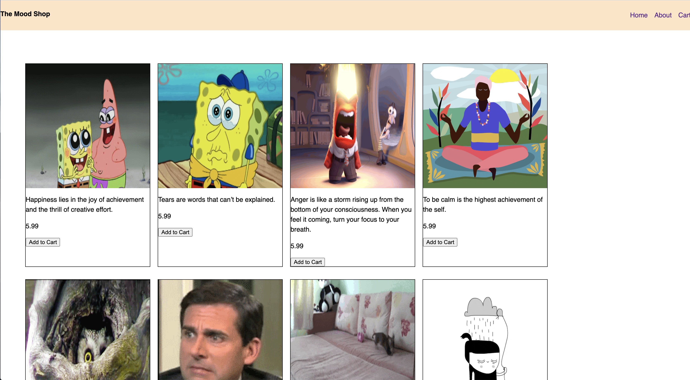

This chapter will focus on styling our page using CSS grid system. Currently our page has items displaying but they have not been styled yet.

At the end of this chapter, we will be able to have something like this.



Our goal is display 4 items on each row and make a card style for each card.

We will use CSS grid properties to position each item in the page.

> [info]
>
> Follow these links to learn about CSS grids:
>
> - [W3 CSS grid](https://www.w3schools.com/css/css_grid.asp),
> - [CSS grid guide](https://css-tricks.com/snippets/css/complete-guide-grid/)

Inside our ```index.html```, The ```<main>``` tag holds all the `div`s displayed in the page. So we should add the grid style on the ```<main>``` tag so its children could be aligned in a grid manner.

We will use its class name to access main.

>[action]
>
> add this to your `styles.css` file below the code you've written so far:
>
```css
.items {
  width: 80%;
  margin: auto;

  display: grid;
  grid-template-columns: repeat(4, 1fr);
  grid-gap: 1em;
}
```

These styles says that main.items should be 80% the width of it's parent (`width: 80%`) and centered since the margin on the left and right will be equal (`margin: auto`). It should arrange it's children in a grid (`display: grid`) and grid will have 4 equal sized columns (`grid-template-columns: repeat(4, 1fr)`) with a gap of 1em between columns and rows (`grid-gap: 1em`). 

Earlier in Chapter 4, when we were making each `div` using the `for` loop, we gave it a class name of `item`. We can use this class name to style the `div`.

Add another style to target each image in the items and size them to fit their grid cell.

```CSS
.items img {
  width: 100%;
  height: auto;
}
```

This rule targets img tags inside of elements with the class name: item. it syas their width chould 100% (`width: 100%`) that makes the images match the width of .item, and height should stay proportional to the width (`height: auto`). 

Your page should now look something like this:


Now all that’s left to do is style each item as a card.
We can add a border on each div so it will look like a card.

Add some styles of your own to customize the content of the grid cells. The contents are: 

- image
- description text 
- price 
- add to cart button

You can target each of these using these selectors: 

Style the entire card: 

```CSS
.item { ... }
```

Style the image in the card: 

```CSS
.item img { ... }
```

Style style both paragraphs in the card. This would be the description and the price: 

```CSS
.item p { ... }
```

Target the first or the second paragraph in a card. The first p is the description and the second is the price: 

```CSS
.item p:nth-child(1) { ... }
.item p:nth-child(2) { ... }
```

Style the add to cart button: 

```CSS
.item button { ... }
```

## Stretch Challenge:

>[challenge]
>
> - Make the “Add To Cart” button appear on the middle of each card
> - Give your button element a background color and some padding
> - Style your button

# Feedback and Review - 2 minutes

**We promise this won't take longer than 2 minutes!**

Please take a moment to rate your understanding of the learning outcomes from this tutorial, and how we can improve it via our [tutorial feedback form](https://forms.gle/BrEWZioQ566MSXMH6)

This allows us to get feedback on how well the students are grasping the learning outcomes, and tells us where we can improve the tutorial experience.

# Update progress on Github

> [action]
>
> Now is a good time to update your progress on Github.
>
```bash
git add .
git commit -m ‘styled items displayed using grid css’
git push
```
