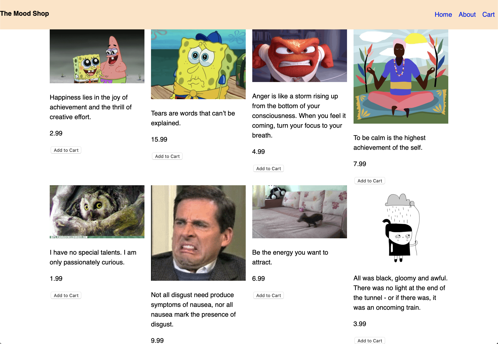

This chapter will focus on styling our page using CSS grid system. Currently our page has items displaying but they have not been styled yet.

At the end of this chapter, we will be able to have something like this.


Our goal is display 4 items on each row and make a card style for each card.

We will use CSS grid properties to position each item in the page.

Follow these links to learn about CSS grids:
[W3 CSS grid](https://www.w3schools.com/css/css_grid.asp),
[CSS grid guide](https://css-tricks.com/snippets/css/complete-guide-grid/)

Inside our ```index.html```, The ```<main>``` tag holds all the `div`s displayed in the page. So we should add the grid style on the ```<main>``` tag so its children could be aligned in a grid manner.

We will use its class name to access main.

>[action]
> add this to your `styles.css` file:
>
```css
.items {
  display: grid;
  grid-template-columns: repeat(4, 120px);
  grid-column-gap: 200px;
  margin-left: 100px;
  margin-top: 50px;
}
```

Your page should now look something like this:



Now all that’s left to do is style each item as a card.
We can add a border on each div so it will look like a card.

Earlier in Chapter 4, when we were making each div using the for loop, we gave it a class name of ‘item’. We can use this class name to style the div.

>[action]
> Add this to your `styles.css`
>
```css
.item {
  border: solid 1px;
  width: 300px;
  margin-top: 30px;
}
```
Now our page should look like this:


## Stretch Challenge:

>[challenge]
>
> - Make the “Add To Cart” button appear on the middle of each card
> - Give your button element a background color and some padding
> - Style your button

# Feedback and Review - 2 minutes

**We promise this won't take longer than 2 minutes!**

Please take a moment to rate your understanding of the learning outcomes from this tutorial, and how we can improve it via our [tutorial feedback form](https://forms.gle/BrEWZioQ566MSXMH6)

This allows us to get feedback on how well the students are grasping the learning outcomes, and tells us where we can improve the tutorial experience.


# Congrats!!

> [action]
>
> Now is a good time to update your progress on Github.
>
```bash
git add .
git commit -m ‘styled items displayed using grid css’
git push
```

**CONGRATS on completing the ecommerce tutorial!** You should now have a better understanding on how to use HTML, CSS, and JS together!
