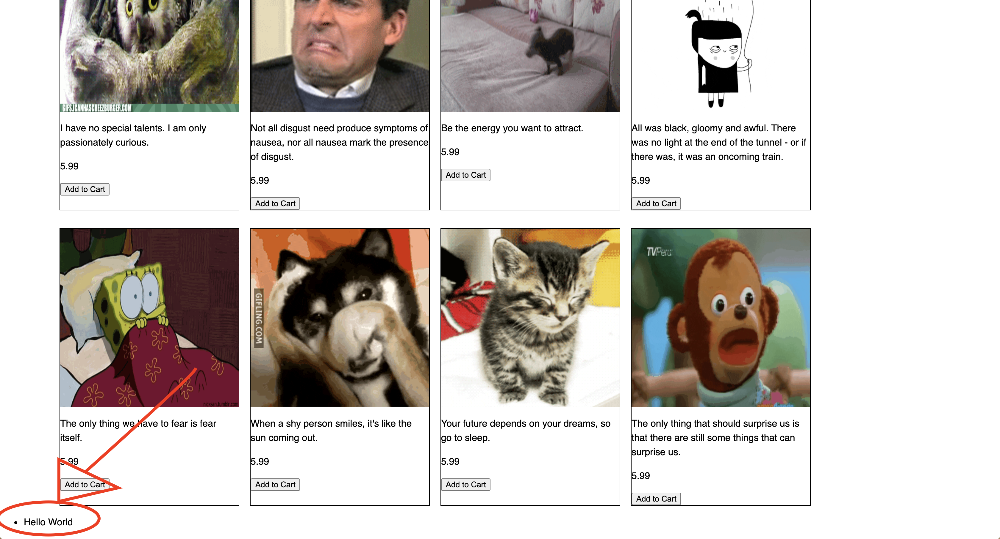

Now that we have written the functions of a shopping cart, it is time to display our results in the browser instead of the console.

Inside the ```<footer>``` element we created in ```index.html```, we need to make a ```<ul>``` element to store the list of cart items we have.


> [action]
>
> Add the ```<ul>``` element to the footer
>
```html
<footer>
    <ul id='item-list'>
      <!-- cart items -->
    </ul>
</footer>
```

We can access this `ul` element in our javascript file using its id **item-list**.

> [action]
> On top of your ```scripts.js``` file, add a variable called `itemList` that will hold the reference to the `ul` element.
>
```js
const itemList = document.getElementById(‘item-list’)
```

You can check if it’s getting the `ul` element by printing it into the console.

> [action]
> Add ```console.log(itemList)``` into your `scripts.js` file to check.
>

You should now see

```html
<ul id='item-list'>
  <!-- cart items -->
</ul>
```
in your console.

# Writing inside the ul element

We can use the property `innerHTML` to write in the `ul` tag.

> [action]
> In your `scripts.js` file, right after you declared the `itemList` variable, add:
>
```js
itemList.innerHTML = '<li> Hello World</li>'
```

This will add a ```<li>``` element named **Hello World** inside our ```<ul>``` element.

If you refresh your page now, you should see a list element named **Hello World**.



## Using itemList.innerHTML to display items in cart

In order to display items in the cart, we need to use ```itemList.innerHTML``` inside our `showItems()` function in ```scripts.js```.

# 8th Video (Start from 5:40 - end)

Follow this video **starting at 5:40** to refactor the `showItems()` function.

Work on the challenges that were mentioned at the end of the video.


# Displaying quantity and total price of your items in cart

Follow video 9 to display quantity of items

> [action]
>
> **Note**: In the video, to display the cart, the `div` and `ul` element goes into the `body` tag, but for our project, **we’re going to put these elements inside the ```<footer> </footer>``` element.**
>
```html
<footer>
    <div id='cart-qty'>
      <!-- cart qty here -->
    </div>
    <ul id='item-list'>
      <!-- cart items -->
    </ul>
    <div id='cart-total'>
      <!-- cart total -->
    </div>
  </footer>
```

# 9th Video

In this video you'll print the quantity and total of all items in the shopping cart.


# Update progress on Github
> [action]
>
> Now is a good time to update your progress on Github.
>
```bash
git add .
git commit -m ‘connect cart to footer’
git push
```
