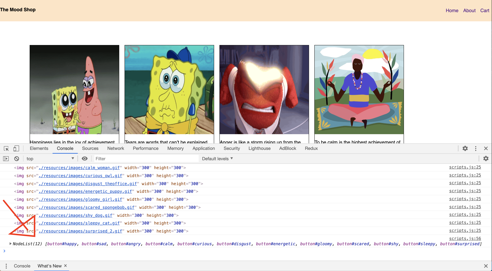
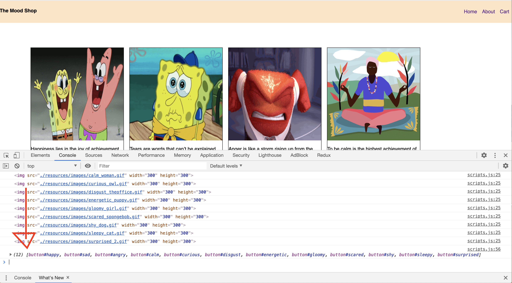
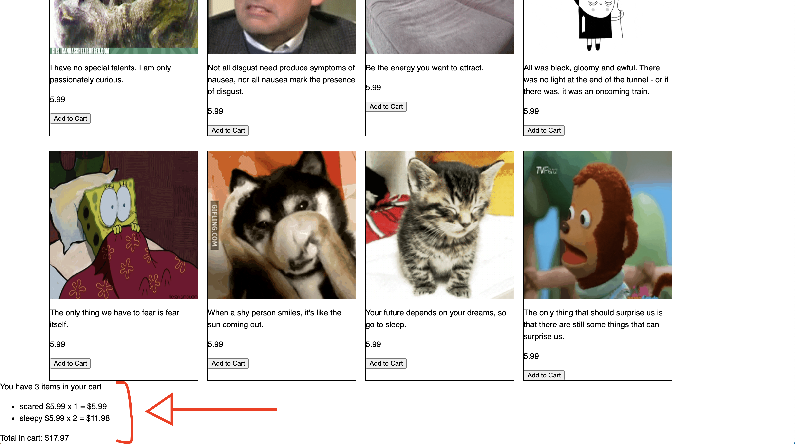

Now that we can show the shopping cart in the footer of our page, the next
step would be to connect our ‘Add to Cart’ buttons on the items to the cart.
This way, when a user clicks on ‘Add to Cart’, the item will be displayed inside
the cart!

# Using querySelectorAll function

The first thing we need to do is get all the buttons from the page. Currently all the buttons on our page are the ‘Add to Cart’ buttons.

To select all buttons, we will use the ```document.querySelectorAll``` function.

This function gives you all the elements in the document that matches the query.

**For example**: if we pass ```document.querySelectorAll(‘button’)```, we will get a node list of all the buttons in our document/page.

> [info]
>
> To learn more about ```document.querySelectorAll``` :
[querySelectorAll info](https://developer.mozilla.org/en-US/docs/Web/API/Document/querySelectorAll)

<!--  -->

> [action]
>
> Use `querySelectorAll` to select all buttons and assign it to a variable named `all_items_button`
>
> Navigate to your `scripts.js` file. Add this code below the for loop you wrote to display items in the page
>
```js
const all_items_button = document.querySelectorAll(“button”)
```

If we print `all_items_button` to our console, we’ll see that this gives us a node list of all the buttons in the document.



We need to convert this into an array. This will make it easier to loop through each button and assign it the `addItem` function.

> [info]
> Check out more on [Array.from info](https://developer.mozilla.org/en-US/docs/Web/JavaScript/Reference/Global_Objects/Array/from)

<!--  -->

> [action]
> Modify the variable `all_items_button` using `Array.from` to convert the node lists into an array:
>
```js
const all_items_button = Array.from(document.querySelectorAll("button"))
```

If you check your console again, you should see array instead of lists.



Now that we have access to all the buttons, we can connect it to the `addItem()` and `showItems()` function when the button is clicked.

We’ll use another `for` loop to

 1. loop through the buttons
 1. check if it’s clicked or not
 1. if clicked, add the item to the cart.

# Adding event listener

> [info]
>
> More info on how to add an [Event listener](https://www.w3schools.com/jsref/met_element_addeventlistener.asp)

We’ll add an event listener for each button, to listen to a click event.

The event listener takes 2 parameters:

1. an event
1. a callback function

Here our event is a click event, and our callback function will be to add the clicked item to the shopping cart.

We'll use `addItem()` and once the item gets added, call `showItems()` function to rerun the `showItems()` to include the added item in the footer.

The `addItem` function takes 2 arguments, which are **name** and **price**.

We’ll get the name of the item from the **button id** and the price from the custom attribute **data-price**.

We’ll use `getAttribute` function to get the attributes `id` and `data-price`.

> [info]
>
> More info on [getAttribute](https://www.w3schools.com/jsref/met_element_getattribute.asp)

<!--  -->

> [action]
>
> Inside your `scripts.js` file, add this `forEach` loop below your `all_items_button` variable
>
```js
all_items_button.forEach(elt => elt.addEventListener('click', () => {
  addItem(elt.getAttribute('id'), elt.getAttribute('data-price'))
  showItems()
}))
```

Now refresh your browser and try adding some items to your shopping cart by clicking on any of the ‘Add to Cart’ buttons.



Woo hoo!! 🎉🎊 Our cart is finally connected with the “Add to Cart” button!!

# Update progress on Github
> [action]
>
> Now is a good time to update your progress on Github.
>
```bash
git add .
git commit -m ‘add button connected to cart’
git push
```
