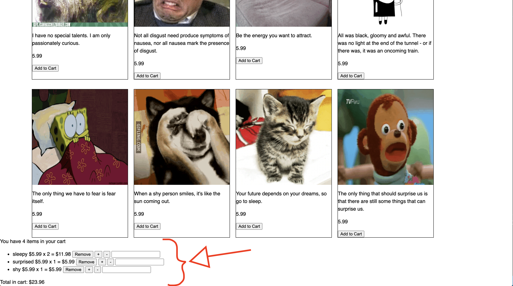

In this last chapter, we will be finishing up the shopping cart functionality.

So far our cart has been connected with the e-commerce page and 'Add to cart' buttons attached to each items.

It would also be nice if we can update the quantity of selected item, and remove an item from our cart.

# Adding “Remove items” button to our Shopping Cart

## 11th Video (Start from 2:25 - end)

Follow this video **starting at 2:25** implement "Remove items" button to our shopping cart. Here you will create a remove item button for each item displayed in the cart.

At the start the video is slightly different but you will be implementing the same functionality throughout the video.


# Adding “add one” and “remove one” buttons for each items inside shopping cart

## 12th Video
Here we'll add a button to remove one item from the cart.


# Updating items in shopping cart

## 13th Video
Here you will add an input that allows you to set the number of items in the cart. To do this you'll listen for an on change event.


Now our page should look like this:




## Stretch Challenge:

>[challenge]
>
> - Style the shopping cart (CSS)
> - Style all the buttons inside the shopping cart (CSS)
> - Remove the dots on the list of items in the shopping cart (CSS)
> - Customize your Mood Shop by changing the theme of the navbar, body and footer (CSS)
> - In the navbar, there is a link called 'cart'. Currently if you click on it, it doesn’t do anything. Connect the link to the shopping cart so that when a user clicks on cart, it takes them to the footer where the cart is located.


# Feedback and Review - 2 minutes

**If you haven't filled out the tutorial survey, please do so now!**

**We promise this won't take longer than 2 minutes!**

Please take a moment to rate your understanding of the learning outcomes from this tutorial, and how we can improve it via our [tutorial feedback form](https://forms.gle/BrEWZioQ566MSXMH6)

This allows us to get feedback on how well the students are grasping the learning outcomes, and tells us where we can improve the tutorial experience.


# Congrats!!

> [action]
>
> Now is a good time to update your progress on Github.
>
```bash
git add .
git commit -m ‘cart fully functional’
git push
```

**CONGRATS on completing the Mood Shop tutorial!** You should now have a better understanding on how to use HTML, CSS, and JS together!
